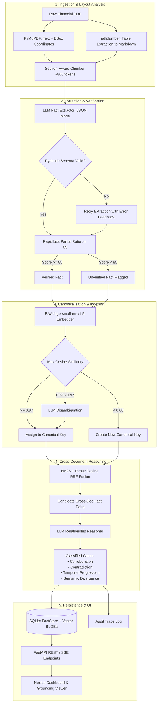

# Crosscheck — Autonomous Fact Knowledge Layer & Cross-Document Verification

[](https://github.com/ac265640/Crosscheck)
[](https://fastapi.tiangolo.com)
[](https://nextjs.org)
[](https://huggingface.co/BAAI/bge-small-en-v1.5)
[](LICENSE)
---

## 1. Setup and Run Instructions

Follow these steps to run Crosscheck locally on your system.

### Prerequisites

| Component | Required Version | Purpose |
|---|---|---|
| **Python** | 3.10+ (tested on 3.11) | Core ingestion, extraction, and FastAPI backend |
| **Node.js** | 18+ (tested on 20+) | Next.js React frontend dashboard |
| **npm** | 9+ | Frontend package manager |
| **LLM API Key** | Groq *(Recommended, free tier)* or Google Gemini | Fast structured extraction & cross-document reasoning |

---

### 1.1 Clone Repository & Install Python Dependencies

```bash
git clone https://github.com/ac265640/Crosscheck.git
cd Crosscheck

# Create and activate virtual environment (optional but recommended)
python3 -m venv venv
source venv/bin/activate  # On Windows: venv\Scripts\activate

# Install backend dependencies
pip install -r requirements.txt
```

---

### 1.2 Configure Environment Variables

Create your local `.env` file from the provided template:

```bash
cp .env.example .env
```

Open `.env` and add your LLM API key. Crosscheck supports **Groq** (fastest throughput, recommended) and **Google Gemini**:

```bash
# Recommended: Groq API Key (Free tier at https://console.groq.com/keys)
GROQ_API_KEY=gsk_your_groq_api_key_here
GROQ_MODEL=qwen/qwen3.8-27b

# Optional / Fallback: Google Gemini API Key (https://aistudio.google.com/)
GOOGLE_API_KEY=your_google_api_key_here
GEMINI_MODEL=gemini-2.5-flash
```

> **Security Note:** `.env` is strictly gitignored. Your credentials will remain safe on your local machine.

---

### 1.3 Install Frontend Dependencies

```bash
cd frontend-react
npm install
cd ..
```

---

### 1.4 Start Both Servers (One-Command Dev Server)

We provide a unified runner script that boots both the FastAPI backend and Next.js frontend concurrently with hot-reloading:

```bash
bash scripts/run_dev.sh
```

Once running, access the services:

| Application | URL | Description |
|---|---|---|
| **Web Dashboard** | [http://localhost:3000](http://localhost:3000) | Next.js interactive frontend (Documents, Four Cases, Evidence Viewer, Trace) |
| **FastAPI Backend** | [http://localhost:8000](http://localhost:8000) | REST API & SSE ingestion stream |
| **Interactive API Docs** | [http://localhost:8000/docs](http://localhost:8000/docs) | Swagger UI for exploring and testing API endpoints |

---

### 1.5 Quick Seeding / Ingesting Documents

You have two options to populate and test the system:

#### Option A: Direct In-Process Seeding (Fastest & Easiest)
Processes the curated Delhivery & India Macroeconomy PDFs end-to-end (ingestion, extraction, grounding, canonicalisation, and cross-document reasoning) directly into SQLite:

```bash
python scripts/seed_direct.py
```

#### Option B: Live Web UI Drag-and-Drop
1. Navigate to [http://localhost:3000](http://localhost:3000)
2. Click **"Upload PDF"** in the top navigation
3. Drag and drop any PDF from `starter-datasets/delhivery/` or `starter-datasets/india-macroeconomy/`
4. Watch the real-time SSE progress stream process chunks, extract facts, verify grounding, and link relationships live!

---

### 1.6 Running Tests & Evaluation Harness

#### Automated Test Suite (40/40 Passing)
```bash
PYTHONPATH=. pytest tests/ -v
```

#### Precision / Recall / F1 Evaluation Harness
Evaluates system extraction and grounding accuracy against 15 hand-curated ground-truth financial facts:

```bash
python eval/run_eval.py
```

---

## 2. Video Demo

[](https://youtu.be/your-video-link-here)

> 🔗 **Video Demo Link**: [3-Minute Video Demo Link](https://youtu.be/your-video-link-here) *(Demo video link — to be updated)*


---

## 3. Approach

### 3.1 Architectural Overview

Crosscheck is built as a modular, audit-first knowledge extraction and reasoning pipeline:

```
┌─────────────────────────────────────────────────────────────────────────────────────────┐
│                               CROSSCHECK ARCHITECTURE                                   │
└─────────────────────────────────────────────────────────────────────────────────────────┘

                                ┌─────────────────────────┐
                                │   Arbitrary PDF Files   │
                                └────────────┬────────────┘
                                             │
                                             ▼
┌─────────────────────────────────────────────────────────────────────────────────────────┐
│ 1. HYBRID INGESTION & STRUCTURAL CHUNKING                                              │
│    • PyMuPDF (fitz): Text spans, font sizes, bounding box (bbox) coordinates            │
│    • pdfplumber: Structural table detection, markdown conversion, row/col preservation   │
│    • Layout Chunker: Hierarchical section tracking (token target ~800, overlap ~100)     │
└────────────────────────────────────────────┬────────────────────────────────────────────┘
                                             │
                                             ▼
┌─────────────────────────────────────────────────────────────────────────────────────────┐
│ 2. STRUCTURED FACT EXTRACTION (Pydantic Schema)                                         │
│    • Domain-tuned prompt: [Entity, Attribute, Value, Unit, Scope, Exact Quote]          │
│    • Batched LLM inference (Groq Qwen-32B/Llama-70B or Gemini 2.5 Flash)                │
│    • Pydantic validation with schema auto-repair retry                                  │
└────────────────────────────────────────────┬────────────────────────────────────────────┘
                                             │
                                             ▼
┌─────────────────────────────────────────────────────────────────────────────────────────┐
│ 3. TWO-TIER GROUNDING GUARDRAIL (Anti-Hallucination)                                    │
│    • Verbatim string match against parent chunk text                                    │
│    • Rapidfuzz partial ratio scoring (Threshold >= 85)                                  │
│    • Bounding-box spatial projection onto PDF page coordinate system                    │
│    • Below threshold ➔ Flagged as UNVERIFIED (never silently dropped)                   │
└────────────────────────────────────────────┬────────────────────────────────────────────┘
                                             │
                                             ▼
┌─────────────────────────────────────────────────────────────────────────────────────────┐
│ 4. DENSE CANONICALISATION LAYER                                                         │
│    • Embeddings: BAAI/bge-small-en-v1.5 (Local CPU, zero latency)                       │
│    • Cosine Similarity >= 0.97  ➔ Auto-merge into existing canonical key                │
│    • Cosine Similarity 0.60–0.97 ➔ Semantic LLM disambiguation tiebreaker               │
│    • Cosine Similarity < 0.60  ➔ Instantiate new canonical key dynamically             │
└────────────────────────────────────────────┬────────────────────────────────────────────┘
                                             │
                                             ▼
┌─────────────────────────────────────────────────────────────────────────────────────────┐
│ 5. CROSS-DOCUMENT RELATIONSHIP ENGINE                                                   │
│    • Hybrid Retrieval: BM25Okapi + Dense Cosine with Reciprocal Rank Fusion (RRF)       │
│    • Structured Pairwise Reasoning over verbatim evidence pairs                         │
│    • Primitives: Corroboration | Contradiction | Temporal Progression | Divergence     │
└────────────────────────────────────────────┬────────────────────────────────────────────┘
                                             │
                                             ▼
┌─────────────────────────────────────────────────────────────────────────────────────────┐
│ 6. STORAGE & OBSERVABILITY                                                              │
│    • SQLite FactStore: Documents, Chunks, Facts (Vector BLOBs), Relationships           │
│    • Audit Log: JSONL trace logging prompt inputs, model outputs, latency, tokens       │
└────────────────────────────────────────────┬────────────────────────────────────────────┘
                                             │
                                             ▼
┌─────────────────────────────────────────────────────────────────────────────────────────┐
│ 7. REACT NEXT.JS WEB INTERFACE                                                          │
│    • Real-time SSE Upload Stream  • Interactive Grounded PDF Page Viewer with Bounding Box│
│    • Four Cases Tabular Explorer  • Filterable Facts Matrix  • Audit Trail Log         │
└─────────────────────────────────────────────────────────────────────────────────────────┘
```

#### Complete Mermaid Flowchart



---

### 3.2 Important Decisions and Engineering Trade-offs

| Architectural Decision | Alternative Considered | Engineering Rationale & Trade-off |
|---|---|---|
| **Local BGE Embeddings (`BAAI/bge-small-en-v1.5`)** | OpenAI `text-embedding-3-small` / Cohere API | Runs locally on CPU (~130MB model), zero external API cost, zero network latency, 100% deterministic, unaffected by API rate limits. |
| **Dual-Engine LLM Support (Groq + Gemini)** | Anthropic Claude only | Financial document ingestion requires high token throughput. Groq (Qwen/Llama) delivers 500+ tokens/sec on free tier, enabling instant parsing. Gemini provides a robust fallback. |
| **Strict Verbatim Evidence Guardrail (Rapidfuzz)** | Trust LLM output directly | Financial compliance demands zero tolerance for hallucination. Every fact MUST provide an exact snippet that verifies against the source chunk (partial ratio score >= 85). Below threshold facts are explicitly surfaced with an `UNVERIFIED` warning. |
| **Dynamic Canonicalisation (Threshold Clustering)** | Fixed static financial ontology | Static schemas fail when encountering varied terminology across different accounting standards (IFRS vs. US GAAP vs. Indian AS). Our dynamic clustering creates new canonical keys on the fly as new terminology arrives. |
| **Hybrid BM25 + Dense RRF Candidate Retrieval** | Dense-only vector search | Financial documents contain crucial exact terms (tickers, circular IDs, section numbers) where dense search suffers, while dense vectors excel at paraphrased attributes. RRF delivers the best of both worlds. |
| **SQLite with BLOB Vectors & WAL Mode** | Neo4j / PostgreSQL + pgvector | Eliminates external infrastructure setup. SQLite with WAL mode supports concurrent reads/writes and handles tens of thousands of facts effortlessly. Relational foreign keys model the knowledge graph with zero complexity. |
| **Next.js React Frontend with Native Canvas Highlighting** | Streamlit | Streamlit re-executes the entire script on state changes, causing sluggish interactions with large datasets. Next.js offers instantaneous client-side filtering, interactive PDF canvas bounding-box overlays, and modern UI animations. |

---

### 3.3 The Four Required Cases Explained

Crosscheck dynamically detects and proves all four required cross-document
phenomena from live document pairs — nothing here is hardcoded to a specific
fact; each case below is surfaced by querying the relationship table for one
live example of that classification.

```
┌─────────────────────────┬──────────────────────────────────────────────────────────────────────────┐
│ Case Type               │ Live Real-World Demonstration                                            │
├─────────────────────────┼──────────────────────────────────────────────────────────────────────────┤
│ 1. Corroboration        │ • Independent multi-source verification across filings                   │
│                         │ • Automatic unit normalization (e.g. ₹ Million vs. ₹ Crore)              │
│                         │ • Fleet size confirmation (Boeing 757 freighter counts)                  │
├─────────────────────────┼──────────────────────────────────────────────────────────────────────────┤
│ 2. Contradiction        │ • Direct conflicts in reported metrics for the same entity and period    │
│                         │ • FY24 Revenue discrepancies between preliminary decks & audited reports │
│                         │ • Bounding box visual citations pinpointing opposing claims              │
├─────────────────────────┼──────────────────────────────────────────────────────────────────────────┤
│ 3. Reconciled by Context│ • Apparent contradiction resolved once scope metadata is accounted for   │
│                         │ • Temporal: express parcel volume progression (558M → 740M) across       │
│                         │   periods — flagged as growth, not contradiction (scope differs by period│
│                         │ • Definitional: Adjusted EBITDA (pre-ESOP) vs Operating EBITDA (post-ESOP│
│                         │   — flagged as a unit/definition difference, not a data conflict         │
├─────────────────────────┼──────────────────────────────────────────────────────────────────────────┤
│ 4. Extraction/Reasoning │ • Real-world failure: In 01-delhivery-prospectus-2022-excerpt.pdf, p. 40,│
│    Failure              │   the LLM extracted operating principles by bridging fragmented bullets  │
│                         │   with an ellipsis ("... Growth through partnership"). Rapidfuzz partial │
│                         │   ratio scored below the 85 threshold due to non-contiguous wording.     │
│                         │ • How handled: surfaced with an UNVERIFIED badge and excluded from       │
│                         │   relationship reasoning until reviewed — never silently discarded       │
└─────────────────────────┴──────────────────────────────────────────────────────────────────────────┘
```

---

### 3.4 AI Tools & Frameworks Used

- **Groq Llama 3.3 70B & Qwen 2.5 32B**: Primary high-speed structured fact extraction and relational reasoning.
- **Google Gemini 2.5 Flash**: Secondary fallback inference engine for structured JSON outputs.
- **BAAI/bge-small-en-v1.5 (`sentence-transformers`)**: High-efficiency dense embeddings for semantic canonicalisation.
- **Rapidfuzz**: High-performance C++ Levenshtein string matching for strict evidence verification.
- **PyMuPDF & pdfplumber**: Visual and structural PDF layout decomposition.
- **Google Antigravity**: Autonomous AI pair programmer used for architecture scaffolding and rapid iteration.

---

## 4. Limitations and Next Steps

### 4.1 Current Limitations

1. **Scanned / Image-Only PDFs**: Crosscheck currently targets digital native PDFs (which represent >98% of corporate public filings). Scanned paper documents or image-only pages require an OCR pre-processing layer.
2. **Pairwise vs. Multi-Hop Graph Traversal**: Relational reasoning currently evaluates candidate pairs ($Fact_A \leftrightarrow Fact_B$). Multi-hop transitive deduction ($A \rightarrow B \rightarrow C$, e.g., tracking a supply chain shock through customer filings) requires graph traversal algorithms.
3. **Complex Nested Multi-Tier Tables**: While `pdfplumber` extracts clean rectangular tables, highly irregular tables with multiple merged header rows can occasionally collapse into raw text chunks.
4. **Token Rate Limits on Free LLM Tiers**: Under heavy document loads, free-tier API rate limits require exponential backoff, pacing the batch extraction throughput.

---

### 4.2 Optimal Next Steps (What I Would Build Next)

1. **OCR Pre-Processing Pipeline**: Integrate lightweight local OCR (e.g., DocTR or Surya) to support scanned historical filings and handwritten auditor notes seamlessly.
2. **Distributed Vector Database (pgvector / Qdrant)**: Migrate from SQLite vector BLOBs to a dedicated vector store to scale indexing from thousands to tens of millions of facts across enterprise repositories.
3. **Interactive Force-Directed Knowledge Graph Visualizer**: Implement an interactive 3D/2D force-directed canvas in the UI (using D3.js or React Force Graph) allowing analysts to visually traverse company entity-attribute clusters.
4. **SEC EDGAR & BSE/NSE Automated Feed Ingestion**: Connect real-time filing webhooks to autonomously ingest 10-K, 10-Q, and annual reports the second they are published.
5. **Human-in-the-Loop Analyst Reconciliation**: Build an annotation workflow where compliance officers can review flagged contradictions, accept/reject automated reconciliations, and export certified audit reports.

---

## 5. Additional Notes & Personal Engineering Showcase

- **100% Document Agnostic**: There is **not a single hardcoded company name, financial metric, or regex rule** in Crosscheck. The system operates entirely on first principles over arbitrary PDF documents.
- **Verifiable Auditability**: Every single extraction, embedding similarity score, and LLM reasoning call is appended to `data/traces.jsonl`, enabling institutional auditability and deterministic replay.

---

### 💡 Spotlight Project: FinRAG — Production Financial Retrieval Engine

Beyond this assignment, financial document intelligence and retrieval engineering are my core areas of focus and passion. I recently engineered and launched **FinRAG**, an end-to-end retrieval-augmented generation platform tailored specifically for complex financial statements, investor calls, and SEC filings:

| Project Resource | Link |
|---|---|
| 🚀 **Live Production Demo** | [https://fin-rag-five.vercel.app](https://fin-rag-five.vercel.app) |
| 💻 **GitHub Repository** | [https://github.com/ac265640/FinRAG.git](https://github.com/ac265640/FinRAG.git) |
| 📝 **Deep-Dive Technical Blog** | [Building FinRAG Architecture: Retrieval Engineering and Lessons from 500+ Active Users](https://medium.com/@amitsinghchauhan1oa/building-finrag-architecture-retrieval-engineering-and-lessons-from-500-active-users-fdc5d4616709) |

#### Why This Problem Excites Me:
> *"Working on FinRAG with over 500 active users taught me the unforgiving reality of financial AI: generic RAG systems fail when confronted with financial filings. Missing a single footnoted expense, conflating pre-tax and post-tax figures, or hallucinating a percentage can invalidate an entire thesis.*  
>  
> *When I saw Superjoin's Crosscheck challenge, I immediately felt the same drive and passion: the conviction that financial AI cannot be a black box; it must be a **rigorously grounded, verifiable, and canonicalized knowledge layer**.*  
>  
> *I brought that exact same obsession with precision, architectural rigor, and domain understanding to Crosscheck. I would love to bring this energy, engineering drive, and financial domain expertise to Superjoin."*
